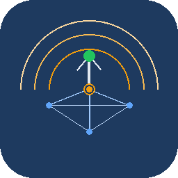

<p align="center">
  
</p>

<h1 align="center">Team Leader</h1>
<p align="center">
  <strong>Multi-operator DXpedition logging system for ham radio</strong><br>
  Real-time peer mesh logging across multiple stations — no master, no single point of failure.
</p>

<p align="center">
  
  
  
  
</p>

---

<!-- TODO: Add screenshots to docs/screenshots/ and uncomment these:

-->

## What is Team Leader?

Team Leader is a real-time QSO logging system built for multi-operator DXpeditions. Every station runs as an equal peer — there is no master node. QSOs logged on any station appear instantly on all others, with automatic duplicate detection across the entire network.

### Key Highlights

- **True peer mesh** — every station is equal, no single point of failure
- **Auto-discovery** — stations find each other automatically via mDNS
- **Real-time sync** — log on one station, see it everywhere instantly
- **Network-wide dupe checking** — prevents duplicates across all operators
- **FlexRadio integration** — native SmartSDR API support via FlexBridge, standalone or alongside SmartSDR/aetherSDR
- **Icom IC-7610 integration** — direct CI-V over the radio's built-in network interface, no USB cable or rigctld needed
- **TCI digimode bridge** — JTDX / MSHV / WSJT-X Improved connect directly to the radio, no BlackHole or virtual audio driver required
- **Band conflict protection** — automatic TX inhibit when two operators are on the same band
- **USB backup** — automatic ADIF export to USB drives every 5 minutes
- **Runs anywhere** — macOS, Linux, web browser, or native Electron app
- **Minimal dependencies** — only 3 npm packages (sql.js, uuid, ws)

---

## Quick Start

### macOS (Native App)

```bash
# One-time setup
npm install
bash install-electron.sh

# Launch
double-click TeamLeader.command
# or: npm run electron
```

### macOS / Linux (Web App)

```bash
npm install
node server.js
# Open http://localhost:7375
```

### Linux (Kiosk Mode — DXpedition kit)

```bash
bash launch-linux.sh --kiosk
```

---

## Features

### Real-Time Logger

<!--  -->

The main logging interface is optimized for speed. Type a callsign, press Enter, and the QSO is logged and broadcast to all stations instantly.

- **One-key logging** — callsign + Enter logs the QSO with auto-filled RST, band, and mode
- **Dupe detection** — flashing red banner warns of duplicates across all stations on the network
- **QSO counter** — live count in the top bar, updated across all stations
- **UTC clock** — NTP-synced clock with drift indicator
- **Click-to-edit** — click any QSO row to edit or delete

### Callsign Field Commands

Type these in the callsign field and press **Enter**:

| Command | Action |
|---------|--------|
| `SSB` / `USB` / `LSB` | Switch to SSB mode |
| `CW` | Switch to CW mode |
| `FT8` | Switch to FT8/digital mode |
| `14225` or `7.023` | Tune to frequency (MHz or kHz) |
| `OPON` | Change operator |
| `QRZ` | Announce to network |
| `ESM` | Toggle Enter Sends Message (CW) |
| `WPM25` | Set CW speed to 25 WPM |

### Keyboard Shortcuts

| Key | Action |
|-----|--------|
| `Enter` | Log QSO or execute command |
| `Escape` | Clear entry fields / cancel CW |
| `F1` | CQ macro (CW) |
| `F2` | Exchange macro (CW) |
| `F3` | TU / sign-off macro (CW) |
| `F4` | Operator change dialog |
| Click row | Edit or delete QSO |

---

### Operator Panel & Rate Display

<!--  -->

- **Per-operator rate bars** — see QSOs/hour for each active operator in real time
- **Band/mode tracking** — shows what band and mode each operator is on
- **Online/offline status** — green dot for active stations, auto-detects disconnections

---

### Peer Mesh Networking

<!--  -->

Team Leader uses a true peer mesh topology. Every station discovers others via mDNS and connects directly — no central server required.

- **Auto-discovery** — stations find each other on the LAN automatically
- **Resilient sync** — if a station disconnects and reconnects, it re-syncs automatically
- **QSO queue** — QSOs logged while offline are queued and flushed on reconnect
- **Cross-station dupe check** — the dupe database spans all connected stations
- **Band conflict protection** — if two operators tune to the same band, a
  flashing warning banner appears on both stations and TX is automatically
  inhibited until one operator moves to a different band

---

### Band Conflict Protection (new)

On a DXpedition, two stations transmitting on the same band causes
interference and wastes operating time. Team Leader watches every operator's
frequency in real time and raises a three-layer alarm the moment two stations
share a band:

1. **Flashing banner** — a red "BAND CONFLICT" banner names the other
   operator and the contested band.
2. **CW TX block** — ESM / CWX transmissions are refused at the browser level
   with a visible "TX BLOCKED" message.
3. **Radio TX inhibit** — FlexBridge sends `xmit 0` to the SmartSDR API,
   forcing MOX off at the hardware level so no RF goes out even if a
   foot-switch is pressed.

The conflict clears automatically the instant one operator QSYs to a
different band, re-enabling TX with no manual intervention.

---

### FlexRadio Integration (FlexBridge)

<!--  -->

Native support for FlexRadio 6000 series via the SmartSDR API. FlexBridge
connects directly to your radio — no rigctld required. It registers as a
full GUI client and creates its own slice, so it works **standalone** without
SmartSDR or aetherSDR running (though it works alongside them too).

- **Auto-discovery** — finds FlexRadios on your network via multicast
- **Frequency & mode display** — live VFO tracking in the logger
- **Frequency control** — type a frequency in the call box to tune the radio
- **CW keying (CWX)** — send CW directly through the radio via ESM mode
- **Split support** — TX/RX frequency tracking
- **Multiple radios** — discover and select from all FlexRadios on the network

#### Setting up FlexBridge

1. Open **Settings** (Cmd+,)
2. Click the **FlexRadio 6000 (FlexBridge)** tab
3. Click **Start FlexBridge**
4. Select your radio from the discovered list
5. Click **Connect**

---

### TCI Digimode Bridge (new)

FlexBridge now exposes an **Expert Electronics TCI v1.9** WebSocket server on
`ws://127.0.0.1:40001`. This lets TCI-aware digimode clients — **JTDX**,
**MSHV**, and **WSJT-X Improved (DG2YCB)** — talk to the FlexRadio directly.

- **No virtual audio driver** — RX audio is streamed as TCI binary frames and
  TX audio flows back the same way. BlackHole, Loopback, and VB-Cable are no
  longer required.
- **CAT over the same socket** — frequency, mode, and T/R control share the
  TCI connection, so there's nothing extra to configure.
- **Radio ↔ client sync** — tuning the radio from SmartSDR or the logger
  pushes VFO and mode updates to all connected TCI clients automatically.
- **RX gain slider** — Settings → FlexBridge tab has a **TCI RX Audio Gain**
  slider (−40 dB … +20 dB, default −15 dB). Drag until WSJT-X's audio meter
  sits in the green.
- **macOS 26 friendly** — the legacy BlackHole sounddevice sink is disabled
  by default (it's broken on macOS 26). Pass `--enable-blackhole` to
  `flexbridge.py` to opt back in if you need the old behavior.

To connect from a TCI client, point its TCI address at `127.0.0.1:40001`
(or the LAN IP of whichever station is running FlexBridge).

---

### CW / ESM Mode (Enter Sends Message)

<!--  -->

Built-in CW contest mode with Enter Sends Message workflow:

1. Type `ESM` to enable ESM mode
2. Press Enter with empty call box to send CQ
3. Type a callsign, press Enter to send the exchange
4. Press Enter again to log and send TU
5. Escape clears the CW queue

**Configurable macros:**
- CQ macro: `CQ CQ {MYCALL} {MYCALL}`
- Call macro: `{CALL} 5NN`
- TU macro: `TU`
- Custom macros can be added in Settings

---

### Icom IC-7610 Integration (new)

Native support for the Icom IC-7610 over its built-in network interface.
Team Leader speaks CI-V directly to the radio over TCP — no rigctld, no
USB cable, no extra software required.

- **Network CI-V** — connects to the IC-7610's LAN IP on port 50001
  (configurable in the radio's network settings)
- **Frequency & mode tracking** — live VFO display in the logger, updated
  in real time via CI-V transceive and 400ms polling
- **Frequency & mode control** — type a frequency or mode in the call box
  and the IC-7610 follows, same as FlexRadio
- **Auto-reconnect** — if the network drops, the bridge reconnects
  automatically
- **Same REST API** — uses the same `/status` and `/cat/command` interface
  as FlexBridge, so all existing features (band conflict protection, TCI,
  peer sync) work without modification

To configure: set `cat.rigType` to `"icom"` and `cat.icom.radioIp` to your
IC-7610's IP address in `config.json`, or use the API:

```bash
curl -X POST http://localhost:7375/api/icom/start
```

---

### Standard CAT / Rig Control

For non-FlexRadio rigs, Team Leader supports CAT control via rigctld (Hamlib):

```bash
# Install Hamlib
brew install hamlib          # macOS
sudo apt install hamlib-utils  # Linux

# Start rigctld for your rig
rigctld -m 3073 -r /dev/cu.usbserial-XXXX -s 19200

# Start the CAT bridge
node cat-bridge.js
```

**Common rig models:** IC-7300 (`3073`), IC-7610 (`3081`), FT-991A (`135`), TS-590SG (`2028`), K3/K3S (`229`)

Find yours: `rigctl --list | grep -i "your rig"`

---

### WSJT-X Integration

<!--  -->

Automatic FT8 logging from WSJT-X:

- **UDP listener** — receives decoded QSOs from WSJT-X
- **Auto-log** — QSOs logged in WSJT-X automatically appear in Team Leader
- **Auto-launch** — optionally start WSJT-X when switching to FT8 mode

Configure in WSJT-X: **File > Settings > Reporting** — enable UDP server, set port to 2237.

> **Tip:** If you use **JTDX**, **MSHV**, or **WSJT-X Improved**, skip the
> audio device setup entirely and connect via the new
> [TCI Digimode Bridge](#tci-digimode-bridge-new) — FlexBridge handles both
> CAT and audio over a single WebSocket connection.

---

### Band Activity & Statistics

<!--  -->

- **Band summary panel** — QSO counts per band, updated in real time
- **Statistics page** — detailed breakdown by band, mode, operator, and DXCC
- **Achievements** — milestones for DXCC counts per band
- **Solar data** — live SFI, A-index, and K-index display

---

### ClubLog Live Streaming

Stream QSOs to ClubLog in real time as they are logged:

1. Open **Settings**
2. Enable **ClubLog** and enter your credentials
3. QSOs are uploaded automatically — no manual export needed

---

### ADIF Export

Export your log in standard ADIF format:

- Click the **ADIF** button in the logger UI
- Or download directly: `http://localhost:7375/api/export.adi`
- Automatic ADIF backup to USB drives every 5 minutes

---

### USB Backup

When a USB drive is connected, Team Leader automatically:

- Exports the full ADIF log every 5 minutes
- Backs up the raw QSO database every 10 QSOs
- Shows USB status in the logger status bar

---

### Setup Wizard

<!--  -->

First-time setup walks through all essential configuration:

- DXpedition callsign
- Operator list
- Station ID
- Network settings

---

### Settings Panel

<!--  -->

Comprehensive settings for all features:

- **Station** — callsign, operator ID, operator list
- **CAT control** — rigctld or FlexBridge configuration
- **CW macros** — ESM macros and custom CW messages
- **ClubLog** — live streaming credentials
- **WSJT-X** — UDP port and auto-launch
- **Network** — HTTP, WebSocket, and CAT ports

---

## Native Desktop App (Electron)

Team Leader runs as a native app on macOS and Linux:

- **System tray** — lives in the menu bar, double-click to show
- **Native menus** — Cmd+, for Settings, Cmd+1/2 for Logger/Stats
- **Auto-server** — the web server starts and stops with the app
- **One-click update** — **Logger → Check for Updates** pulls the latest
  code from GitHub, runs `npm install` if dependencies changed, and
  restarts the app. Operators in the field can update in seconds without
  touching the terminal

### Building Distributable Packages

```bash
npm run build:mac      # .dmg + .zip (Intel + Apple Silicon)
npm run build:linux    # .AppImage + .deb + .tar.gz
npm run build:all      # Both platforms
```

---

## Architecture

```
┌─────────────────────────────────────────────────────────┐
│                    Team Leader Station                   │
│                                                         │
│  ┌──────────┐    ┌──────────┐    ┌───────────────────┐  │
│  │ Browser  │◄──►│ server.js│◄──►│  Peer Stations    │  │
│  │ (UI)     │ WS │ (Node)   │ WS │  (mDNS discovery) │  │
│  └──────────┘    └────┬─────┘    └───────────────────┘  │
│       :7375      :7373│:7374                            │
│                       │                                 │
│              ┌────────┼────────┐                        │
│              ▼        ▼        ▼                        │
│         ┌────────┐ ┌──────┐ ┌────────┐                  │
│         │SQLite  │ │USB   │ │ClubLog │                  │
│         │(sql.js)│ │Backup│ │Upload  │                  │
│         └────────┘ └──────┘ └────────┘                  │
│                                                         │
│  ┌──────────────┐    ┌──────────────┐                   │
│  │ FlexBridge   │◄──►│ FlexRadio    │                   │
│  │ (Python)     │    │ (SmartSDR)   │                   │
│  └──────────────┘    └──────────────┘                   │
│       :7376              :4992                          │
│                                                         │
│  ┌──────────────┐    ┌──────────────┐                   │
│  │ cat-bridge.js│◄──►│ rigctld      │                   │
│  │ (optional)   │    │ (Hamlib)     │                   │
│  └──────────────┘    └──────────────┘                   │
│       :7374              :4532                          │
└─────────────────────────────────────────────────────────┘
```

### Network Ports

| Port  | Protocol  | Purpose |
|-------|-----------|---------|
| 7375  | HTTP      | Web interface + REST API |
| 7373  | WebSocket | Browser real-time updates |
| 7374  | WebSocket | Peer-to-peer QSO sync |
| 7376  | HTTP      | FlexBridge REST API |
| 7377  | HTTP      | Icom CI-V bridge REST API |
| 40001 | WebSocket | FlexBridge TCI server (digimode clients) |
| 4532  | TCP       | rigctld CAT control |
| 4992  | UDP/TCP   | SmartSDR API (FlexRadio) |
| 2237  | UDP       | WSJT-X QSO input |
| 5353  | UDP       | mDNS peer discovery |

---

## File Layout

```
teamleader/
├── server.js              # Main backend (HTTP + WS + SQLite + sync)
├── cat-bridge.js          # CAT control bridge (rigctld / FlexBridge)
├── config.json            # Runtime configuration (git-ignored)
├── config.operator.json   # Config template for new stations
├── package.json           # Node.js dependencies
├── TeamLeader.command     # macOS launcher
├── TeamLeader.sh          # Linux launcher
├── check.sh               # Pre-flight diagnostic
├── MASTER.SCP             # Callsign prefix database
│
├── public/
│   ├── index.html         # Main logger UI
│   ├── settings.html      # Settings panel
│   ├── setup.html         # First-run wizard
│   └── stats.html         # Statistics & achievements
│
├── electron/
│   ├── main.js            # Electron main process
│   ├── preload.js         # IPC bridge
│   └── build/             # App icons and desktop files
│
└── flexbridge/
    └── src/
        └── flexbridge.py  # FlexRadio SmartSDR bridge
```

---

## Troubleshooting

Run the pre-flight diagnostic:
```bash
bash check.sh
```

This checks Node.js version, dependencies, port conflicts, and network connectivity.

---

## Multi-Operator Testing

Open multiple browser tabs at `http://localhost:7375` to simulate multiple operators. Each tab is an independent station. Log in one tab and watch it appear instantly in all others.

On a real DXpedition, each laptop connects to any other station's IP:
```
http://192.168.1.100:7375
```

---

<p align="center">
  <strong>Built for DXpeditioners by DXpeditioners</strong><br>
  <em>by WW2DX</em>
</p>
